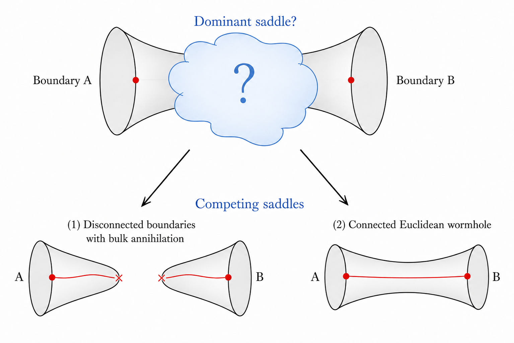
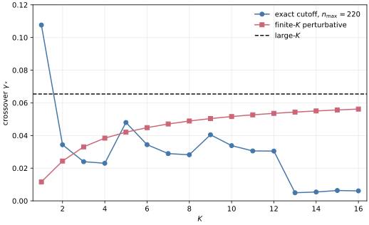
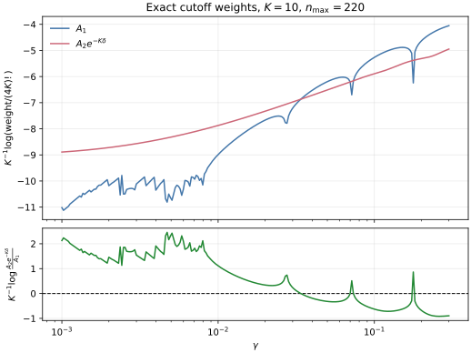
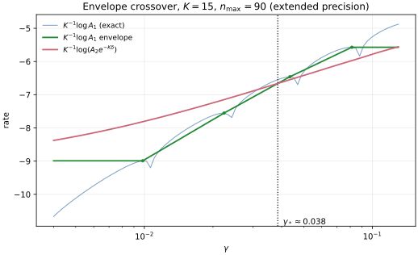

# A Toy Model of Wormholes 

> Brian Swingle + Claude Code with Opus 4.8 + Codex with GPT 5.5 
> June 22, 2026 
> Confidence: Medium (as a toy model) 
> Reports from [GPT 5.5](conn-vs-disconn/reports/report-2026-06-22-codex-gpt5.html) and [Opus 4.8](conn-vs-disconn/reports/report-2026-06-22-claude-opus-4-8.html) 
> Acknowledgements: I thank Martin Sasieta and Mark Van Raamsdonk for discussions.

In a paper with my collaborators Stefano Antonini and Martin Sasieta [(AS$^2$)](https://arxiv.org/abs/2307.14416), we discussed certain wormhole solutions in general relativity sourced by dust-shell matter. We argued these solutions could dominate the Euclidean path integral under the right conditions and that in this case one found interesting closed universe physics. Nevertheless, there is a general concern that there might be other saddle points that qualitatively change the story, and this possibility is usually hard to rule out.

One often appeals to other physical intuitions to argue for the correctness of a given saddle, even if one cannot rule out other possibilities with a completely general argument. However, because the physics of closed universes in holography is still a subject in flux, it's worth thinking more about this issue of saddle points.

In recent [work](https://arxiv.org/abs/2602.12339) with my student Val, we gave evidence in a particular microscopic model, the Sachdev-Ye-Kitaev model, that such wormhole solutions do give a good account of the physics, but here I want to think through a toy model of the physics along the lines suggested in an appendix of AS$^2$.

## Holographic motivation

In holography, one specifies some boundary conditions and then searches for a bulk ``filling in'' of those boundary conditions according to a set of rules. For example, the bulk geometry must obey Einstein's equations, or some generalization thereof. Often it is not clear what the filled in geometry should be, so one must consider various competing possibilities. 

I want to consider a case in which the boundary consists of two disjoint pieces, each of which hosts a bunch of matter modelled as non-interacting dust. The bulk can then be either disconnected or connected, in which case it forms a kind of wormhole. Using red to denote the matter, the competition is illustrated in this sketch (made by GPT 5.5 based on my sketch):

If the Euclidean path integral is written schematically as
$$ Z = \int Dg\, e^{- I[g]},$$
then the most naive rule is to look for the solution with the smallest action $I$, since its contribution, $e^{-I}$, to $Z$ is presumably the largest.

One often finds that the wormhole geometry costs more action, meaning the disconnected solution would dominate. This would render the closed universe physics associated with the wormhole solution somehow subleading to the dominant disconnected physics. That certainly may be the way it works in some cases. 

However, a nice feature of the wormhole solution is that the red matter worldline can smoothly connect between the two boundaries, whereas in the disconnected case the matter must somehow self-annihilate within each disconnected space. Such a self-annihilation should generically be possible in quantum gravity, assuming the matter is essentially non-interacting dust, but perhaps this self-annihilation process is sufficiently suppressed that the two saddles have an interesting competition.

For example, suppose the dust consisted of a dilute gas of Hydrogen. There is no conservation law that forbids self-annihilation (Hydrogen is electrically neutral, baryon and lepton number are not exact symmetries, etc.), but the process is unlikely to occur. The boundary interpretation could be that on boundary A we are trying to create a lot of Hydrogen (e.g. applying many copies of a Hydrogen creation operator) and on boundary B we are trying to destroy a lot of Hydrogen (e.g. applying many copies of a Hydrogen annihilation operator). It is not impossible that the corresponding annihilation and creation of Hydrogen occur in the bulk of A and B, respectively, but it is unlikely. The question is whether this suppression from the matter sector can compete with the suppression arising from the wormhole's larger action.

For a simple bulk model, we could take a scalar field $\phi$ representing the dust and include a weak $\phi^4$ interaction that allows for self-annihilation or creation. For parameters, assuming Newton's constant, $G$, is small (the usual large $N$ limit), it's interesting to consider an $O(1/G)$ amount of matter (to generate backreaction and stabilize the wormhole) along with a weak $O(G)$ $\phi^4$ coupling. Below I will consider an even simpler version of this as a first step to a more complete bulk analysis. 

## Oscillator model

I propose to model the competition using a simple quantum anharmonic oscillator. The Hamiltonian is
$$ H = \omega a^\dagger a + g( a+ a^\dagger)^4,$$
and I'll suppose that $g$ is very small. $a^\dagger$ and $a$ are creation and annihilation operators that correspond to the matter particles described by the scalar field $\phi$, and the smallness of $g$ translates to a weak $\phi^4$-type coupling in the bulk. Crucially, the quanta counted by $a^\dagger a$ are not conserved by the Hamiltonian, but they may be approximately conserved owing to the weakness of the interaction. To capture the large $N$ scaling, I'll introduce a parameter $K$ and assume that the number of quanta added is $O(K)$ and $g$ is $O(1/K)$.

I'll model the connected vs disconnected competition as a comparison between two quantities, 
$$A_1= |\langle 0 | e^{- s H} (a^\dagger)^{4K} | 0\rangle|^2$$
and 
$$ A_2 = \langle 0| a^{4K} e^{- 2 s H} (a^\dagger)^{4K} | 0\rangle $$
where $a|0\rangle=0$. $|0\rangle$ is the ground state of $H$ when $g=0$.

I think of $(a^\dagger)^{4K}$ as creating the dust, which is specifically chosen to consist of a lot of approximately conserved quanta. By analogy with the holographic setting, the basic quantity is 
$$ \langle 0 | a^{4K} (\mathrm{something}) (a^\dagger)^{4K} | 0\rangle$$
where $(\mathrm{something})$ stands for the unknown ``filling in'' of different bulk options in the gravitational path integral. In other words, I consider different choices of $(\mathrm{something})$ and look to determine which option is larger.

From this perspective, $A_1$ amounts to the replacement
$$(\mathrm{something}) \to e^{-s H} |0\rangle \langle 0 | e^{- sH},$$
which is analogous to the disconnected saddle. By contrast, $A_2$ arises from the replacement
$$(\mathrm{something}) \to e^{-2 s H} ,$$
which is analogous to the connected bulk saddle in which the particles can join with their partners at the other end of the wormhole. I will also include an additional factor in $A_2$ to model the different action costs of the disconnected and wormhole saddles (the part not directly associated with the matter).

So the final comparison is between $A_1$ and $A_2 e^{-\Delta I}$ where $\Delta I$ is an additional free parameter of the model. I will assume $\Delta I$ is also $O(K)$. An application of Cauchy-Schwarz shows that $A_1 \leq A_2$, so if $\Delta I>0$, there is the possibility of an interesting competition between the two terms. For the large $K$ comparison, define $\delta$ and $\gamma$ by $\Delta I = K \delta$ and $g = \gamma/K$.

## Perturbative calculation

The calculations of $A_1$ and $A_2$ are straightforward to leading order in perturbation theory. The basic point in the case of $A_1$ is that one needs at least $K$ factors of the quartic interaction to get a non-zero result, so $A_1=0$ when $s=0$ (or $\gamma=0$). By contrast, $A_2=(4K)!$ when $s=0$. In the opposite limit, $s\to \infty$, the results instead are 
$$A_1 \to e^{-2 s E_{\mathrm{gs}}} |\langle 0 | \mathrm{gs} \rangle \langle \mathrm{gs} | (a^\dagger)^{4K} |0\rangle|^2$$
and 
$$A_2 \to e^{- 2 s E_{\mathrm{gs}}} |\langle \mathrm{gs} | (a^\dagger)^{4K} |0\rangle|^2$$
where $|\mathrm{gs}\rangle$ is the ground state of $H$. In this limit, $A_1$ and $A_2$ differ only by a factor of $|\langle \mathrm{gs} | 0 \rangle|^2$, which will be close to unity at large $K$ since $g=\gamma/K$ is small. Thus for $\delta>0$ and sufficiently large $s$, I expect a phase transition in which $A_1$ and $A_2 e^{-\Delta I}$ exchange dominance as $\gamma$ is increased.

Here is the detailed calculation. Let
$$n=4K,\qquad I(s)=\int_0^s d\tau\, e^{-4\omega \tau}
=\frac{1-e^{-4\omega s}}{4\omega}.$$
In the interaction picture,
$$V_I(\tau)=\left(a e^{-\omega \tau}+a^\dagger e^{\omega \tau}\right)^4.$$
For
$$B(s)=\langle 0|e^{-sH}(a^\dagger)^n|0\rangle,$$
the first non-zero contribution comes from $K$ insertions of the term that
lowers the particle number by four. Thus
$$B(s)=\frac{(-g)^K}{K!}I(s)^K
\langle 0|a^{4K}(a^\dagger)^{4K}|0\rangle+O(g^{K+1}),$$
and hence
$$A_1(s)=\left[\frac{(4K)!}{K!}\right]^2
\left[g I(s)\right]^{2K}+O(g^{2K+1}).$$

For $A_2$, write
$$|\psi(s)\rangle=e^{-sH}(a^\dagger)^n|0\rangle,\qquad
A_2(s)=\langle \psi(s)|\psi(s)\rangle.$$
Keeping the leading process in each Fock-number sector, the component with
$n-4j$ particles is
$$c_j(s)=\langle n-4j|\psi(s)\rangle
=(-1)^j\frac{n!}{j!\sqrt{(n-4j)!}}\,
e^{-s\omega(n-4j)}
\left[gI(s)\right]^j+O(g^{j+1}).$$
This gives the approximation
$$A_2(s)\simeq \sum_{j=0}^K
\frac{(n!)^2}{(n-4j)!(j!)^2}
e^{-2s\omega(n-4j)}
\left[gI(s)\right]^{2j}.$$
This is not meant as the fixed-order leading expansion of $A_2$, which would
only keep the $j=0$ term. Instead, it keeps the leading process in each sector
with a different final particle number.

The final term, $j=K$, is precisely the leading expression for $A_1$. Therefore
$$\frac{A_2(s)}{A_1(s)}\simeq
\sum_{\ell=0}^K \frac{1}{(4\ell)!}
\left[\frac{K!}{(K-\ell)!}\right]^2 y(s)^{2\ell},$$
where
$$y(s)=\frac{e^{-4\omega s}}{gI(s)}
=\frac{4\omega e^{-4\omega s}}{g(1-e^{-4\omega s})}.$$

Now set $g=\gamma/K$ and $\Delta I=K\delta$. Then
$$y(s)=Kc(s),\qquad
c(s)=\frac{4\omega e^{-4\omega s}}
{\gamma(1-e^{-4\omega s})}.$$
At large $K$, the ratio has the form
$$\frac{A_2(s)}{A_1(s)}\sim \exp\left[K f(c(s))\right],$$
where
$$f(c)=\max_{0\leq \rho\leq 1}\Phi(\rho;c)$$
with
$$\Phi(\rho;c)=
-2(1-\rho)\log(1-\rho)+2\rho+2\rho\log c
-4\rho\log(4\rho).$$
The saddle obeys
$$c(1-\rho)=16\rho^2.$$
At this saddle the rate function simplifies to
$$f(c)=2\rho_*(c)-2\log(1-\rho_*(c)).$$

The weighted comparison is therefore controlled by
$$\frac{A_2(s)e^{-K\delta}}{A_1(s)}
\sim \exp\left[K(f(c(s))-\delta)\right].$$
Thus the large $K$ transition occurs when
$$f(c_*)=\delta.$$
Equivalently, if $q=1-\rho_*$, then
$$\frac{\delta}{2}=1-q-\log q,\qquad
c_*=\frac{16(1-q)^2}{q}.$$
For fixed $\gamma$ and $\delta$, the transition time is
$$s_*=\frac{1}{4\omega}\log\left(1+\frac{4\omega}{\gamma c_*}\right).$$
Equivalently, at fixed $s$ the critical interaction strength is
$$\gamma_*=\frac{4\omega e^{-4\omega s}}
{c_*(1-e^{-4\omega s})}.$$

The conclusion is that there is a non-zero $\gamma_*$ such that for $\gamma<\gamma_*$, the connected answer wins despite the extra action cost, while for $\gamma>\gamma_*$, the disconnected answer wins because the weak
self-annihilation process is no longer sufficiently suppressed. For small $\delta$, one has $c_*\simeq \delta^2$, which makes explicit that even a small action cost can lead to a sharp large-$K$ competition.

Agent note: Codex (GPT-5) added the perturbative calculation and large-$K$
comparison in this section on June 22, 2026.

## Numerical calculation

As an example, consider the case $\omega=1$, $s=1$, and $\delta=1$. At large $K$, the perturbative prediction then yields a crossover at
$$q_*=0.7662486082,\qquad c_*=1.140929199,$$
and hence
$$\gamma_*^{(\infty)}=0.06541110658.$$

I can also compare this to numerics at finite $K$. For $K=1,2,3,\cdots$, the exact answer can be computed by imposing a cutoff $n_{\max}$ on the number of quanta and making sure the answer is converged as a function of $n_{\max}$. Since the Hamiltonian preserves parity, I restricted to the even Fock sector. The numerical calculation is in `calculation-1`; it diagonalizes the cutoff Hamiltonian and finds the first crossing of
$$\frac{A_2 e^{-K\delta}}{A_1}$$
as $\gamma$ is increased. For comparison, I also show the finite-$K$ crossing predicted by the perturbative sum above. Using $n_{\max}=220$, I find
$$
\begin{array}{c|ccc}
K & \gamma_*^{\rm exact, first} &
\gamma_*^{\rm pert} & \gamma_*^{(\infty)} \\
\hline
1 & 0.10765449 & 0.01162137 & 0.06541111\\
2 & 0.03435154 & 0.02437472 & 0.06541111\\
3 & 0.02397843 & 0.03305853 & 0.06541111\\
4 & 0.02301296 & 0.03840007 & 0.06541111\\
5 & 0.04798293 & 0.04203323 & 0.06541111\\
6 & 0.03439949 & 0.04482553 & 0.06541111\\
7 & 0.02892992 & 0.04706499 & 0.06541111\\
8 & 0.02821508 & 0.04887944 & 0.06541111\\
9 & 0.04047296 & 0.05036770 & 0.06541111\\
10 & 0.03380631 & 0.05160906 & 0.06541111\\
11 & 0.03055754 & 0.05266126 & 0.06541111\\
12 & 0.03048058 & 0.05356492 & 0.06541111\\
13 & 0.00496243 & 0.05434938 & 0.06541111\\
14 & 0.00541595 & 0.05503664 & 0.06541111\\
15 & 0.00633907 & 0.05564363 & 0.06541111\\
16 & 0.00611356 & 0.05618363 & 0.06541111\\
\end{array}
$$
The finite-$K$ perturbative estimate moves steadily toward the large-$K$
prediction as $K$ grows, as expected. The exact cutoff crossings show a more
complicated story. For small $K$, they give a direct full-Hamiltonian check of
the same competition, but by larger $K$ the first crossing is strongly affected
by zeros or near-zeros of the transition amplitude in $A_1$. Thus the exact
first-crossing column should not be read as a clean approach to the large-$K$
perturbative saddle. Rather, it is a useful warning that the full oscillator
has additional finite-$K$ structure, including the number-conserving pieces of
$(a+a^\dagger)^4$ that are not resummed in the simple leading perturbative
estimate.

For a more direct view of the competition, here are the two common-factor-stripped
weights for $K=10$ as functions of $\gamma$. The plotted quantities are
$K^{-1}\log(A_1/(4K)!)$ and $K^{-1}\log(A_2e^{-K\delta}/(4K)!)$.

The cutoff dependence of the exact first crossing is shown separately in
`calculation-1/figures/cutoff_convergence.svg`.

Agent note: Codex (GPT-5) implemented `calculation-1` and added the finite-$K$
numerical comparison in this section on June 22, 2026; Codex later upgraded the
calculation to use NumPy/SciPy and extended the scan to $K=16$.

## Refined numerical study

The first numerical calculation uncovered some subtleties worth a closer look. The exact first crossing of the previous section is apparently not a very clean observable at larger $K$, for two distinct reasons that I disentangle in `calculation-2`.

First, the disconnected amplitude $B(\gamma)=\langle 0|e^{-sH}(a^\dagger)^{4K}|0\rangle$,
whose square is $A_1$, is not sign-definite. Beyond its leading
small-$\gamma$ behavior $B\sim(-\gamma)^K$, competing multi-step processes
cancel and $B$ develops honest zeros at a discrete set of finite $\gamma$ (I
confirmed this at $60$-digit precision). At such a zero $A_1\to 0$ and
$\log(A_2 e^{-K\delta}/A_1)\to+\infty$, so the first crossing as $\gamma$
increases is set by the location of the nearest zero rather than by the smooth
competition of the two weights.

Second, and more insidiously, a double-precision diagonalization cannot reach
the crossover region at all once $K\gtrsim 12$. There $|B|$ falls below
$\sim 10^{-21}$, and the value returned for $B$ is then floating-point
round-off: it reproduces across cutoffs $n_{\max}$ (the same banded round-off
each time) yet is wrong in magnitude and even in sign. This is the real reason
the exact first crossings above fail to settle as $n_{\max}$ is increased — the
obstruction is the precision floor, not the Hilbert-space truncation.

Both problems are cured in `calculation-2`. I recompute $A_1$ and $A_2$ at
$s=1$ in extended precision ($40$ digits), and I replace the fragile first
crossing with a crossover read off from the smooth envelope of $A_1$. Writing
$B=E(\gamma)\times(\mathrm{oscillation})$, the local maxima of $|B|$ between
consecutive zeros trace the smooth envelope $E$; interpolating $\log A_1$
through these peaks and intersecting it with the smooth weight
$\log(A_2 e^{-K\delta})$ yields a single, zero-insensitive crossover
$\gamma_*(K)$. The construction is shown for $K=15$ here:

The resulting crossover shows no downward drift with $K$, in contrast to the
first-crossing column. Cutoff-convergence spot checks leave it unchanged to the
digits shown as $n_{\max}$ is varied (at $K=14$ over $n_{\max}=80,120,160$, and
at $K=16,18$ up to $n_{\max}=140$); the limiting uncertainty is instead the
grid resolution of the envelope construction, which fixes $\gamma_*$ only to
about two significant figures (of order $1\%$). Using $n_{\max}=90$:
$$
\begin{array}{c|cc}
K & \gamma_*^{\rm env} & \gamma_*^{(\infty)} \\
\hline
10 & 0.0399 & 0.0654\\
11 & 0.0412 & 0.0654\\
12 & 0.0392 & 0.0654\\
13 & 0.0399 & 0.0654\\
14 & 0.0393 & 0.0654\\
15 & 0.0385 & 0.0654\\
16 & 0.0393 & 0.0654\\
17 & 0.0386 & 0.0654\\
18 & 0.0376 & 0.0654\\
\end{array}
$$
Across $K=10$ through $18$ the crossover sits on a flat, nonzero plateau,
$\gamma_*\simeq 0.038$–$0.041$. This lies about $40\%$ below the large-$K$
perturbative value $\gamma_*^{(\infty)}=0.0654$ — a genuine finite-$K$
suppression — but it is plainly approaching a nonzero limit rather than
collapsing to zero. Two further smoothings, a running average of $A_1$ in
$\gamma$ and an average over the evolution parameter $s$, give the same
qualitative picture of a stable nonzero crossover (the $s$-average samples
$s<1$, since the weights grow as $s$ decreases, so it only corroborates the
trend, and its double-precision implementation itself breaks down at the
largest $K$, with the $K=18$ point falling into the collapsed band rather than
the plateau). The comparison of all the diagnostics, including the misleading
first-crossing column, is collected here:

The absolute crossover value retains a method dependence at the $\sim30\%$
level (the envelope gives $\simeq 0.039$, the $\gamma$-window average
$\simeq 0.030$), which reflects a genuine ambiguity in pinning the crossing of
an oscillating finite-$K$ amplitude. The robust, method-independent statement
is the existence of a nonzero plateau with no downward drift.

Agent note: Claude (Opus 4.8) implemented `calculation-2` and added this
section on June 22, 2026, after the precision and zero-structure issues were
identified in `reports/report-2026-06-22-claude-opus-4-8.md`. Earlier sections
and `calculation-1` were left unchanged. The precision claims and table digits
here were subsequently tightened the same day, following the Codex (GPT-5)
report (`reports/report-2026-06-22-codex-gpt5.md`) and a grid-resolution check.

## Outlook

I think the summary is overall positive for this toy model. The perturbative calculation gives a clean answer in the large $K$ limit, while the finite $K$ numerics exhibit more structure. In particular, there are subtleties to do with precision and zeros in $A_1$. However, some refined numerics gave a result that is largely stable as $K$ is increased. The perturbative large $K$ value of $\gamma_*$ is not quantitatively accurate, but the finite $K$ result is of the same order of magnitude. Although this issue could benefit from further scrutiny (and one attempt is recorded in calculation-3), the crossover between the two competing terms appears robust. Thus, at least in this toy model, there is good evidence that the connected wormhole saddle can dominate at sufficiently weak coupling, i.e. when the self-annihilation/creation processes are sufficiently suppressed.
