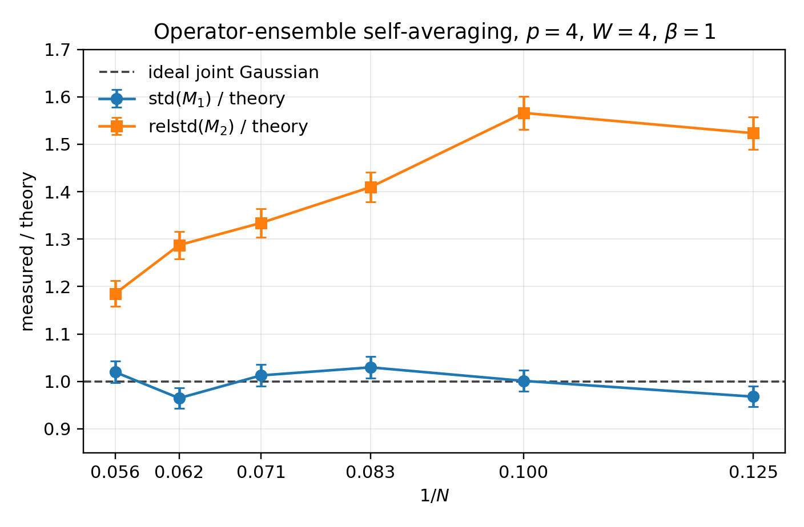

# Random Couplings and Ensembles of Operators

> Brian Swingle + Claude Code with Opus 4.8 + Codex with GPT 5.5 
> June 16, 2026 
> Confidence: High 
> Reports from [Opus 4.8](couplings-vs-ops/reports/report-opus-4-8-2026-06-05.html), [GPT 5.5](couplings-vs-ops/reports/report-codex-gpt5-2026-06-09.html) 
> Acknowledgements: Helpful discussions with Martin Sasieta and Shiyong Guo

In recent work with Val Bettaque, we studied the erratic properties of thermal 1-point functions in the Sachdev-Ye-Kitaev (SYK) model. The general problem is to determine the expectation value of a given operator in the thermal state of a given Hamiltonian. In the SYK context, we considered strings of fermion operators in the Gibbs state of the $p$-body SYK model. These string expectation values depend on the random couplings defining the Hamiltonian, so they are themselves random variables. Predicting their precise value given the couplings is difficult when the string contains many fermions, but predicting their statistical properties is tractable. That is all worked out in our [paper](https://arxiv.org/abs/2602.12339) using path integral tools to work directly at large $N$.

Part of the motivation for this is the heavy operator randomness hypothesis [put forward](https://arxiv.org/abs/2307.14416) in AS$^2$, which is relevant for making sense of closed universes in holographic quantum gravity; this hypothesis is also related to prior ideas such as this [work](https://arxiv.org/abs/2006.05499) of Belin and de Boer. The basic idea is that operators that create a lot of energy should have random-looking matrix elements. This sort of hypothesis is similar in spirit to the eigenstate thermalization hypothesis, although they address physically different parameter regimes.

We were also motivated to develop new tools to study the resource known as non-stabilizerness or quantum magic. I won't talk more about that in this entry except to note that some [others](https://arxiv.org/abs/2509.17417) have also developed path integral approaches to this problem in SYK. For more about magic, you can read our paper or take a look at the previous entry.

## Setup

To get back to the problem, I'll start with some notation. The fermion operators are $\psi_i$ for $i=1,...,N$ and they obey $ \{ \psi_i , \psi_j \} = 2 \delta_{ij}.$ (Note that physics discussions often work in terms of fermions with a slightly different normalization, $\tilde{\psi}_i = \psi_i/\sqrt{2}$.) The string operators are 
$$ \mu(a)=i^{W(W-1)/2} \psi_1^{a_1} \cdots \psi_N^{a_N},$$
where the binary $N$-component vector $a$ specifies the string and the phase factor ensures $\mu$ is Hermitian. $W = \sum_i a_i$ is the weight of the string. Throughout $N$ is taken to be even.

The Hamiltonian is the $p$-body SYK model,
$$ H = \frac{i^{p/2}}{p!} \sum_{I} J_I \psi_I.$$
The $I$s run over strings with weight $p$ and the $J$s are Gaussian random with zero mean and variance
$$ \mathbb{E}_J(J_I^2) = \frac{(p-1)!}{N^{p-1}} \frac{J^2}{2^p}.$$ $\mathbb{E}_J$ indicates an average over the $J$ couplings.

Now pick a string $\mu(a)$ and consider $\xi(a) = \text{tr}(\rho \mu(a))$ where $\rho = e^{-\beta H}/Z$ is the Gibbs state at inverse temperature $\beta$. For SYK, the partition function itself is self-averaging if $\beta$ does not scale with $N$, so its fine to separately average the numerator and denominator in $\xi(a)$. The other key point is that the SYK ensemble has a statistical $O(N)$ invariance that acts as an orthogonal transformation of the fermions. This invariance implies that
$$ \mathbb{E}_J(\xi(a))=0.$$

## Gaussian 1-point functions

It turns out that these thermal 1-point functions can be modeled as Gaussian random variables when $N$ is large and $p>2$. As noted above, they have zero mean, so the non-trivial information is all contained in the covariance. In the paper, we showed that $ \mathbb{E}_J( \xi(x)^2) $ is only a function of the weight of the string. This also follows from the statistical $O(N)$ symmetry because the precise identity of the string does not matter.

Generalizing, one can also look at the covariance between two strings, with the result that
$$ \mathbb{E}_J(\xi(a) \xi(a')) = \delta_{a,a'} \sigma^2(a).$$
This result is exact at any $N$ as another consequence of the $O(N)$ symmetry.

It's helpful to make this all a bit more concrete. At large $N$ and fixed $\beta J$, I can give explicit formulas for various thermal 1-point functions. As a simple example, for $p=4$ and $W=4$, the 1-point function for $a=(1,1,1,1,0,\cdots,0)$ is proportional to the corresponding $J$,
$$ \xi(a) \sim \langle \psi_1 \psi_2 \psi_3 \psi_4 \rangle \sim J_{1234}.$$ This is indeed a Gaussian with mean zero. If we choose any other 4-tuple, the component of the $J$ tensor that appears would be different but the variance would be the same. Moreover, because all the $J$s are independent, even changing a single index leads to zero covariance,
$$ \mathbb{E}_J( \langle \psi_1 \psi_2 \psi_3 \psi_4\rangle \langle \psi_1 \psi_2 \psi_3 \psi_5\rangle ) = \mathbb{E}_J( J_{1234} J_{1235} ) = 0.$$

However, as I will show below, this joint Gaussianity only emerges at large $N$. At finite $N$, there are corrections to the $\xi(1234) \sim J_{1234}$ formula that lead to correlations between $\xi(a)^2$ and $\xi(b)^2$, even though the covariance of $\xi(a)$ and $\xi(b)$ remains a delta function by symmetry.

## Switching ensembles

So far I've considered thermal 1-point functions of a fixed operator as the random $J$ couplings are varied. Because many Hamiltonians don't naturally have random couplings, it is important to ask if we can see the same physics using an approach that doesn't rely on random couplings.

A simple idea is to try to replace the ensemble of random couplings with an ensemble of operators. For example, since the statistical properties above were just a function of the total weight, one could consider an ensemble of all fermion strings of a fixed weight $W$. This ensemble has $\binom{N}{W}$ elements, which is exponential in $N$ when $W = \alpha N$ with $\alpha$ fixed as $N\to\infty$.

I'll use $\overline{f(\xi)}$ to denote the average of function $f$ of the thermal 1-point function $\xi$ over the uniform ensemble of weight $W$ Majorana strings
$$ \overline{f(\xi)} \equiv \frac{1}{\binom{N}{W}} \sum_{a , |a|=W} f(\xi(a)).$$ 
For a fixed realization of the couplings at large $N$, I expect that 
$$ M_1 \equiv \overline{\xi(a)} \approx 0$$
and
$$ M_2 \equiv \overline{\xi(a)^2} \approx \sigma^2(W).$$
But how close are the two sides of these equations?

To get a sense of that, it's useful evaluate the $J$ ensemble average and variance of $M_1$. Linearity of expectations implies that 
$$\mathbb{E}_J(M_1) = \frac{1}{\binom{N}{W}} \sum_{a, |a| = W} \mathbb{E}_J(\xi(a)) = 0.$$ For the second moment, a short calculation gives
$$ \mathbb{E}_J(M_1^2) = \frac{1}{\binom{N}{W}^2} \sum_{a,b, |a| = |b| = W} \mathbb{E}_J(\xi(a) \xi(b)) = \frac{\sigma^2(W)}{\binom{N}{W}}.$$
To get this, I used the covariance of 1-point functions under the $J$ ensemble discussed in the previous section. Since the $J$ variance of $M_1$ is so small, its value in a given fixed sample of the $J$s will be close to zero.

For $M_2$, the calculations are similar and just a bit more involved. The cleanest first pass is to assume that the $\xi(a)$s are jointly Gaussian with respect to the $J$ ensemble. First, the average of $M_2$,
$$ \mathbb{E}_J(M_2) = \frac{1}{\binom{N}{W}} \sum_{a, |a| = W} \mathbb{E}_J(\xi(a)^2) = \sigma^2(W).$$
Now for the second moment of $M_2$,
$$ \mathbb{E}_J(M_2^2) = \mathbb{E}_J(M_2)^2 + 2 \frac{\sigma^4(W)}{\binom{N}{W}}.$$
Once again the $J$ variance of $M_2$ is heavily suppressed if the number of operators is large.

There is a useful way to organize the leading correction to this ideal Gaussian answer. Let $D=\binom{N}{W}$, $\xi_a \equiv \xi(a)$, and write the four-point function as
$$
\mathbb{E}_J(\xi_a\xi_b\xi_c\xi_d)
=\sigma^4(W)\left(\delta_{ab}\delta_{cd}+\delta_{ac}\delta_{bd}+\delta_{ad}\delta_{bc}\right)+\kappa_{abcd}.
$$
The exact two-point function fixes the Wick part, but it does not force $\kappa_{abcd}$ to vanish. For $M_2$ only the components $\kappa_{aabb}$ matter:
$$
\mathrm{Var}_J(M_2)
=\frac{2\sigma^4(W)}{D}\left[
1+\frac{\overline{\kappa_{aaaa}}}{2\sigma^4(W)}
+\frac{1}{2\sigma^4(W)D}\sum_{a\neq b}\kappa_{aabb}
\right].
$$
Here $\overline{\kappa_{aaaa}}$ denotes the average over weight-$W$ strings. The first correction is ordinary single-string excess kurtosis, while the second is a cross-string fourth cumulant. The numerical data below suggest that the first term is tiny, so individual strings are indeed very close to Gaussian, and that the visible non-Gaussianity is mostly the second term. In other words, the failure is not that a single $\xi(a)$ has a non-Gaussian distribution; it is that $\xi(a)^2$ and $\xi(b)^2$ remain weakly correlated for related strings at finite $N$.

A microscopic model of this phenomenon can be gotten from a high-temperature expansion. For $p=W=4$,
$$
\xi_a = c_1\beta J_a+\beta^2 Q_a(J)+\cdots,
$$
where the first term is an independent Gaussian for each string and $Q_a(J)$ is a quadratic polynomial in the couplings. The leading term gives the ideal joint-Gaussian answer. The higher-order terms can be built from overlapping sets of couplings when two strings share fermion indices, and this generates $\kappa_{aabb}\neq 0$ without producing a large marginal kurtosis. At fixed $\beta$ this is still a finite-size correction, so the bracket above should approach $1$ at large $N$.

I can make this estimate even more concrete. For a string $S=ijkl$, the first two terms have the schematic form
$$
\xi_{S}=A J_{ijkl}
+B\sum_{u<v}\left(
J_{ijuv}J_{uvkl}
+J_{ikuv}J_{uvjl}
+J_{iluv}J_{uvjk}
\right)+\cdots,
$$
with $A=O(\beta)$ and $B=O(\beta^2)$ at high temperature. Now compare two strings $S$ and $T$. If $S$ and $T$ share exactly two fermions, the quadratic term in $\xi_S$ contains a monomial $J_T J_{S\triangle T}$, and the quadratic term in $\xi_T$ contains the matching monomial $J_S J_{S\triangle T}$. This gives
$$
\kappa_{SSTT}\sim A^2B^2\,\mathbb{E}(J^2)^3,
\qquad
\frac{\kappa_{SSTT}}{\sigma^4}\sim \frac{B^2}{A^2}\mathbb{E}(J^2)\sim \frac{\beta^2}{N^3},
$$
up to order-one combinatorial factors. Pairs with no shared fermions do not contribute at this order. Since a fixed weight-$4$ string has $6\binom{N-4}{2}=O(N^2)$ other strings sharing two fermions, the total off-diagonal correction in the $M_2$ variance scales as
$$
\frac{1}{2\sigma^4 D}\sum_{S\neq T}\kappa_{SSTT}\sim \frac{\beta^2}{N}.
$$
This is the leading reason I expect the fourth-cumulant correction to drop with $N$ at fixed $\beta$, while becoming much more visible as the temperature is lowered.

## Numerical tests

As a quick numerical check, I implemented a small exact-diagonalization test in `calculation-1`. The calculation uses the Jordan-Wigner representation of Majorana strings, stored compactly as phase-weighted permutations of the computational basis. It samples the $p=4$ SYK Hamiltonian at finite $N$, computes the thermal one-point functions $\xi(a)=\mathrm{tr}(\rho\mu(a))$ for every weight-$4$ string, and then forms $M_1$ and $M_2$ for each disorder realization.

The most direct finite-size diagnostic is to compare the measured sample-to-sample fluctuations of $M_1$ with the prediction
$$
\mathrm{std}_J(M_1) \approx \sqrt{\frac{\sigma^2(W)}{\binom{N}{W}}}.
$$
For $\beta=1$, using $1000$ disorder samples for each $N$, I found
$$
\begin{array}{c|ccc}
N & \binom{N}{4} & \mathrm{std}(M_1)/\mathrm{std}_{\rm pred}(M_1) &
\mathrm{relstd}(M_2)/\sqrt{2/\binom{N}{4}} \\
\hline
8 & 70 & 0.97 & 1.52 \\
10 & 210 & 1.00 & 1.57 \\
12 & 495 & 1.03 & 1.41 \\
14 & 1001 & 1.01 & 1.33 \\
16 & 1820 & 0.96 & 1.29 \\
18 & 3060 & 1.02 & 1.19
\end{array}
$$
The agreement for $M_1$ is quite good. The $M_2$ fluctuations are larger than the ideal independent-Gaussian estimate at the smaller sizes, but only by an order-one factor, and the discrepancy decreases as the system size is increased. This is consistent with the basic self-averaging picture, while also showing that finite-size and finite-temperature corrections are visible in the more sensitive fourth-moment observable. In the cumulant language above, the data indicate a positive cross-string contribution to $\sum_{a\neq b}\kappa_{aabb}$ whose relative size drops with $N$ at $\beta=1$. Since $\beta=1$ and $\beta=4$ are not deep in the high-temperature regime and the system sizes are small, these runs should be read as confirming the sign of the cross-string cumulant and its decrease with $N$, rather than as a quantitative test of the $\beta^2/N$ law.

The same run also checked the disorder distribution of individual $\xi(a)$s. The empirical mean excess kurtosis of the weight-$4$ one-point functions was approximately $-0.08,-0.03,-0.02,-0.01,-0.01,-0.01$ for $N=8,10,12,14,16,18$, respectively, close to the Gaussian value. The mean absolute off-diagonal sample correlation between distinct strings was about $0.025$ in these runs, comparable to the sampling noise expected from $1000$ disorder realizations.

A lower-temperature run at $\beta=4$ gave the same qualitative agreement for $M_1$, with $\mathrm{std}(M_1)/\mathrm{std}_{\rm pred}(M_1)=0.92,1.15,0.97$ for $N=8,10,12$. The $M_2$ ratios were larger, about $2.3,2.3,2.7$, which is not surprising: at lower temperature and small $N$, higher powers in the $J$ expansion of $\xi_a$ become more important, so the cross-string fourth cumulant is easier to see.

Agent note: Codex (GPT-5) implemented `calculation-1` and edited this section of the entry to report the numerical results from that calculation on June 5, 2026.

## Results

The main lesson is that, at least for these low moments, the ensemble over operators can substitute for the ensemble over random couplings. More precisely, suppose the thermal one-point functions are independent Gaussians with respect to the $J$ ensemble,
$$
\mathbb{E}_J(\xi(a)\xi(b))=\delta_{a,b}\sigma^2(W).
$$
Then the fixed-Hamiltonian operator averages over all strings of weight $W$ are self-averaging:
$$
M_1=\overline{\xi(a)}=O_J\left(\frac{\sigma(W)}{\sqrt{\binom{N}{W}}}\right)
$$
and, in the ideal joint-Gaussian limit,
$$
M_2=\overline{\xi(a)^2}=\sigma^2(W)\left(1+O_J\left(\sqrt{\frac{2}{\binom{N}{W}}}\right)\right).
$$
Here the $O_J$ notation means the typical size of the fluctuations as the Hamiltonian is varied. More generally, the $\sqrt{2}$ coefficient in the $M_2$ line is multiplied by the square root of the fourth-cumulant bracket written above. It is worth emphasizing that $M_2$ still self-averages: its fluctuations are set by the small $1/\binom{N}{W}$ prefactor, and the cumulant correction only shifts the $O(1)$ bracket away from its ideal value. The exact diagonal covariance makes the $M_1$ statement especially robust, but for $M_2$ we saw that it is this deviation of the prefactor from the ideal $\sqrt{2}$ that is only suppressed by a power of $N$ at low weight, rather than exponentially. It would be interesting to analyze in detail the case where $W \sim \alpha N$.

This calculation gives a simple example in which a single chaotic Hamiltonian can contain its own effective ensemble of heavy operators. The random couplings are useful for doing the calculation, but after the covariance structure is known, the exponentially large (at high weight) set of fixed-weight Majorana strings supplies enough samples to reproduce the same low-moment statistics in one typical realization.

The exact-diagonalization tests support this picture in the small systems where the calculation can be done directly. For $p=4$, $W=4$, and $N=8,10,12,14,16,18$, the measured fluctuations of $M_1$ agree very well with the predicted $\binom{N}{4}^{-1/2}$ scaling. The second moment $M_2$ also self-averages, though it shows larger finite-size corrections, especially at lower temperature.

To come back to the holographic motivation, the lesson is that one can access wormhole physics for erratic heavy operator matrix elements, e.g. $\sigma(W)^2$, even with a fixed Hamiltonian by averaging over a suitable collection of heavy operators. This could be useful in higher dimensions where one could average over operators instead of couplings to have a sharp microscopic model of AS$^2$. 
