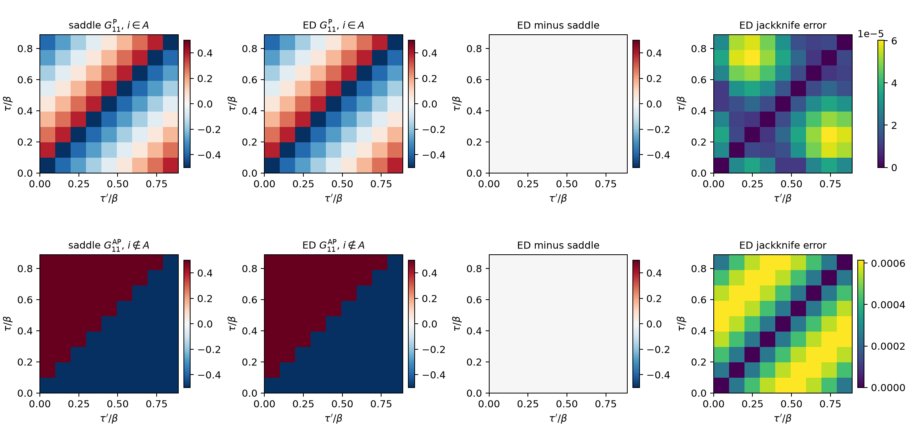
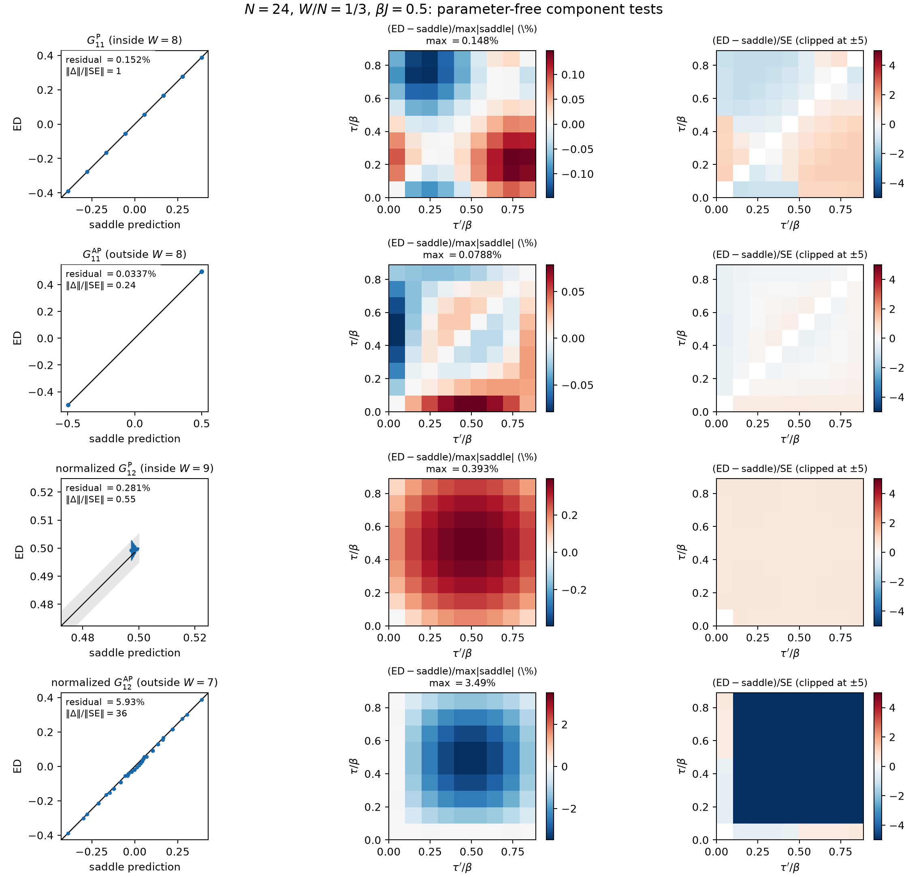
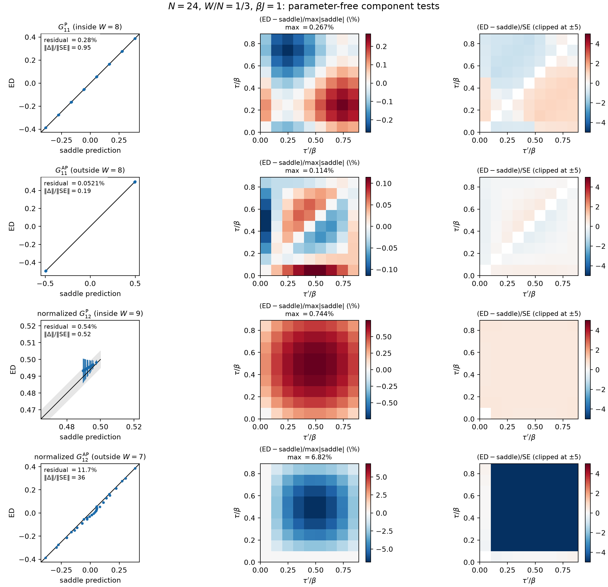

# Multireplica $G\Sigma$ variables from finite $N$ numerics

> Brian Swingle + Codex with GPT 5.6 Sol + Claude Code with Fable 5 
> August 6, 2026  
> Confidence: High 
> Reports from Fable 5 ([July 30](syk-ed-op-stat/reports/2026-07-30-status-report-claude-fable-5.html), [August 3](syk-ed-op-stat/reports/2026-08-03-report-claude-fable-5.html)) and [GPT 5.6 Sol](syk-ed-op-stat/reports/2026-08-03-report-codex-gpt-5.6-sol.html) 
> Acknowledgements: Val Bettaque, Martin Sasieta, Alejandro Vilar Lopez

Recently I've been interested in the general problem of computing thermal expectation values in a single instance of the SYK model. Given $N$ fermions $\psi_i$ with the algebra $\{ \psi_i , \psi_j \} = \delta_{ij}$ and an instance of the SYK Hamiltonian
$$ H = \sum_I i^{p/2} J_I \psi_{i_1} \cdots \psi_{i_p}$$
where $I = \{ i_1 \cdots i_p \}$, the goal is to compute
$$ \xi_A = i^{|A|(|A|-1)/2} 2^{|A|/2} \langle \prod_{i \in A} \psi_i \rangle_\beta$$
where
$$\langle \cdots \rangle_\beta = \frac{\mathrm{Tr}( \cdots e^{-\beta H})}{\mathrm{Tr}( e^{-\beta H})}.$$ The factors in the definition of $\xi_A$ are chosen so that the Majorana string
$$\mu_A = i^{|A|(|A|-1)/2} 2^{|A|/2}  \prod_{i \in A} \psi_i$$
is Hermitian and squares to the identity. The cardinality of $A$ is also called the weight of the string, $W = |A|$.

In a soon-to-appear paper, I developed a diagrammatic approach that is useful when $N$ is large compared to $\beta J$ and $W$. However, when $W$ is comparable to $N$ and both are large, the diagrammatic approach hits trouble because it is not clear what the important diagrams are. An alternative approach that I worked out with Val Bettaque computes the statistical properties of $\xi_A$ via path integral methods. One cannot predict the instance-by-instance values of $\xi_A$, but one can compute moments of $\xi_A$ over the ensemble of Gaussian $J_I$s.

One quantity that featured in that analysis is the large $N$ collective field $G_{rs}(\tau,\tau')$ where $rs$ are replica indices and $\tau$ and $\tau'$ are imaginary times. For example, when computing the second moment of $\xi_A$, one invokes two replicas, one for each power of $\xi_A$, and the collective field is a $2 \times 2$ matrix in replica space. This journal entry arose from asking if $G_{rs}$ could be given meaning outside of the path integral approach. This problem is a bit trickier than the analogous question for the standard thermal Greens function because of the presence of the replicas. Nevertheless, I think the answer is yes, and I'll explain how.

Think of the trace in $\xi_A$ as associated with a circle, the imaginary time circle of extent $\beta$, with $W$ fermions placed at a specific point in imaginary time, say $\tau=0$. I can generalize $\xi_A$ slightly by peeling off one fermion from the clump at $\tau=0$ and placing it at a general imaginary time $\tau$. More generally, I can remove one fermion from the clump and place another fermion, which could be different, at a general $\tau$. When $W$ is large, this barely changes the nature of the main clump at $\tau=0$ but it gives a handle to probe the "configuration" induced by the clump. 

Let $\zeta_{A i} (\tau) =  \textrm{Tr}(e^{-\beta H} \psi_i(\tau) \mu_{A}  ) / Z(\beta)$. Note that $A$ needs to contain an odd number of fermions for $\zeta_{Ai}$ to be non-zero. A first guess is that
$$ \frac{1}{N} \sum_i \mathbb{E}_J( \zeta_{A i}(\tau) \zeta_{Ai}(\tau')) \propto G_{12}(\tau,\tau'),$$
up to $1/N$ corrections. There is also an implicit claim that, after averaging, the result does not depend on the precise identity of $A$. 

However, as shown in [calculation-1](syk-ed-op-stat/calculation-1/readme.html), this turns out to be a little too simplistic, at least at small $N$. Part of the issue is that there are important symmetries that constrain $\xi_A$ and $\zeta_{Ai}(\tau)$. For example, when $p=4$, $\xi_A$ vanishes unless $W=|A|=4,8,12,\cdots$. Instead, it makes sense to break down the situation by whether $i \in A$ or not. Even this is slightly tricky: at large $N$ and $W$, removing or adding a fermion hardly changes the relative weight of $A$, but at finite $N$ there are strong discrete effects because every odd-weight string has a vanishing thermal expectation value.

A proposal to match the finite $N$ and collective field approaches has to deal with these issues. Suppose I want to understand the case $A = \{ 1,2,3,4\}$. I cannot add a single probe fermion because this would make the total number of fermions odd. I can, however, remove one fermion from $A$, say $\psi_4$, and place that fermion or any other fermion not in $A \setminus \{4\}$ at general imaginary time $\tau$. This leads to the proposal 
$$ \frac{1}{N-3} \sum_{ i \notin (A \setminus \{4\})} \mathbb{E}_J( \zeta_{(A\setminus\{4\}) i}(\tau) \zeta_{(A\setminus\{4\})i}(\tau')) \propto (G^{\mathrm{AP}})_{12}(\tau,\tau'),  $$
where $G^{\mathrm{AP}}$ is obtained by taking the fermion derivative with the usual anti-periodic boundary condition and computing
$$ G^{\mathrm{AP}} = - (D^{\mathrm{AP}} - \Sigma)^{-1}.$$

Similarly, for the fermions $i$ in $A$ I cannot simply add an extra $\psi_i$ to the trace, since the total number of fermions is again odd. However, I can add an extra fermion to $A$, say $\psi_5$, and then also add the same fermion at general $\tau$. In fact, I can do this for any fermion in $A \cup \{5\}$. Hence, the proposal is
$$ \frac{1}{5} \sum_{ i \in (A \cup \{5\})} \mathbb{E}_J( \zeta_{(A \cup \{5\}) i}(\tau) \zeta_{(A \cup \{5\})i}(\tau')) \propto (G^{\mathrm{P}})_{12}(\tau,\tau'),  $$
where $G^{\mathrm{P}}$ is obtained by taking the fermion derivative with the periodic boundary condition and computing
$$ G^{\mathrm{P}} = - (D^{\mathrm{P}} - \Sigma)^{-1}.$$

This was all with the specific example of $A=\{1,2,3,4\}$, but it extends in a straightforward way to general $A$. I will specialize to $A$ with weight $W = 0 \mod 4$ in the $4$-body model. Then to obtain the AP case, remove one fermion from $A$ and carry out the sum over the remaining $N-W+1$ probes. Similarly, the $P$ case is obtained by adding one fermion to $A$ and then summing over the $W+1$ fermions in the augmented $A$. Moreover, since everything is being averaged, it won't matter precisely which fermions are in $A$, or which fermions or added or removed. And the resulting objects can then be compared to the corresponding collective fields at relative weight $w=W/N$. Of course, the meaning of $w$ is a little fuzzy since fermions are being added and removed from $A$, but it might be that the differences in $w=W/N$ become subleading as $N \to \infty$. Nevertheless, comparing to finite $N$ requires making a specific choice.

## Testing the proposal

I tested the AP and P parts of this proposal separately at $N=20$ and
$\beta J=0.5$, using 100 disorder realizations and nine equally spaced
imaginary times. The first calculation used

$$
A_-=\{1,2,3\}
$$

and averaged over the 17 probes $i\notin A_-$. The resulting ED surface has
the sign-changing time dependence expected of the AP sector. Comparing it
with the conditional $G^{\mathrm{AP}}_{12}$ at the literal clump weight
$w=3/20$ gives a cosine similarity of $0.998854$ after fixing the
normalization at the collision, with a relative residual of $0.0507$. Using
the target weight $w=4/20$ instead gives a slightly larger residual of
$0.0552$. Thus the AP propagator captures the qualitative form and most of
the quantitative time dependence, although the remaining smooth
approximately five-percent discrepancy is much larger than the disorder
sampling error. The code, raw samples, and earlier fitted and centered
comparisons are in [calculation 2](syk-ed-op-stat/calculation-2/readme.html).

The P-sector test used

$$
A_+=\{1,2,3,4,5\}
$$

and averaged over the five probes $i\in A_+$. Here the agreement with the
conditional $G^{\mathrm P}_{12}$ is considerably stronger. At the literal
weight $w=5/20$, the collision-normalized surfaces have cosine similarity
$0.999999969$ and relative residual $8.25\times10^{-4}$. The norm of their
difference is smaller than the norm of the ED jackknife-error surface. At
the target weight $w=4/20$, the residual is $1.62\times10^{-3}$. A fixed
probe, $i=5$, gives comparably good results. Details and reproducible outputs
are in [calculation 3](syk-ed-op-stat/calculation-3/readme.html). These tests strongly support
the assignment of the outside probes to the AP object and the inside probes
to the P object. The monodromy argument below derives this boundary-condition
assignment; the numerics test the stronger quantitative identification with
the conditional propagators.

There is an important normalization issue in making this statement precise.
For either odd clump $A_\pm$,

$$
X_{A_\pm}=\operatorname{Tr}(e^{-\beta H}\mu_{A_\pm})=0
$$

by fermion parity. At the collision, however, the probe combines with the
odd clump to form the even string

$$
B_i=A_\pm\mathbin{\triangle}\{i\}.
$$

In both tests $|B_i|=4$. Define the unnormalized traces

$$
Y_{A i}(\tau)
=\operatorname{Tr}\!\left(e^{-\beta H}\psi_i(\tau)\mu_A\right),
\qquad
X_{B_i}=\operatorname{Tr}\!\left(e^{-\beta H}\mu_{B_i}\right).
$$

The Clifford algebra fixes

$$
\psi_i\mu_A=c_i\mu_{B_i},\qquad
c_i^2=
\begin{cases}
-1/2,&i\notin A,\\
+1/2,&i\in A.
\end{cases}
$$

This suggests comparing the annealed, moment-normalized ED objects

$$
\mathcal C_{\mathrm{AP}}(\tau,\tau')
=
\frac{\frac{1}{N-|A_-|}\sum_{i\notin A_-}
\mathbb E_J[Y_{A_-i}(\tau)Y_{A_-i}(\tau')]}
{\frac{1}{N-|A_-|}\sum_{i\notin A_-}\mathbb E_J[X_{B_i}^2]},
$$

and

$$
\mathcal C_{\mathrm P}(\tau,\tau')
=
\frac{\frac{1}{|A_+|}\sum_{i\in A_+}
\mathbb E_J[Y_{A_+i}(\tau)Y_{A_+i}(\tau')]}
{\frac{1}{|A_+|}\sum_{i\in A_+}\mathbb E_J[X_{B_i}^2]}.
$$

Unlike the original $\zeta$ covariance, these are ratios of disorder
averages of unnormalized traces; the thermal partition function is not
divided out sample by sample. Their collision values are predicted exactly,

$$
\mathcal C_{\mathrm{AP}}(0,0)=-\frac12,\qquad
\mathcal C_{\mathrm P}(0,0)=+\frac12.
$$

The numerical comparisons quoted above contain no fitted amplitude. They
test

$$
\mathcal C_{\mathrm{AP}}(\tau,\tau')
\stackrel{?}{=}
-\frac12\,
\frac{G^{\mathrm{AP}}_{12}(\tau,\tau')}
{G^{\mathrm{AP}}_{12}(0,0)},
\qquad
\mathcal C_{\mathrm P}(\tau,\tau')
\stackrel{?}{=}
+\frac12\,
\frac{G^{\mathrm P}_{12}(\tau,\tau')}
{G^{\mathrm P}_{12}(0,0)}.
$$

The saddle surfaces in this comparison were evaluated on aligned
$L_\tau=90$ and 180 grids and extrapolated using
$2G_{180}-G_{90}$ to remove the leading forward-difference error.

Dividing by $G_{12}(0,0)$ is at present an additional prescription, not a
consequence of a derivation. Indeed, the raw conditional propagators cannot
be compared directly with the moment-normalized ED objects: at the common
weight $w=4/20$ their continuum-extrapolated collision values are

$$
G^{\mathrm{AP}}_{12}(0,0)=-0.052608,\qquad
G^{\mathrm P}_{12}(0,0)=4.75227,
$$

rather than $-1/2$ and $+1/2$. Intriguingly, they satisfy

$$
G^{\mathrm P}_{12}(0,0)G^{\mathrm{AP}}_{12}(0,0)
=-0.250005\simeq-\frac14.
$$

The approach to $-1/4$ under time-lattice refinement, and its persistence at
other weights and temperatures on the connected branch, are consequences of
an exact P/AP boundary-update identity derived below. If

$$
\Lambda=2G^{\mathrm P}_{12}(0,0)
=-\frac{1}{2G^{\mathrm{AP}}_{12}(0,0)}
\qquad (L_\tau\to\infty),
$$

then the reciprocal redefinition

$$
\widehat G^{\mathrm P}_{12}=\Lambda^{-1}G^{\mathrm P}_{12},
\qquad
\widehat G^{\mathrm{AP}}_{12}=\Lambda G^{\mathrm{AP}}_{12}
$$

gives the canonical collision values $+1/2$ and $-1/2$ simultaneously. The
reciprocal relation between the two conditional kernels is therefore fixed by
their spin structures, not fitted numerically. What remains a prescription is
the physical step of using these canonically collision-normalized kernels as
the comparators for the cross-replica ED moments; unlike the same-side case
below, that step has not yet been obtained from a source derivative.

*Codex (GPT-5) drafted this section from calculations 2 and 3 on July 30,
2026.*

## Mechanisms underlying the comparison

### Why inside probes are P and outside probes are AP

The boundary-condition part of the dictionary is not conjectural: it
follows from a one-line monodromy identity. Using cyclicity of the trace
and $e^{-\beta H}\psi_i(\beta)=\psi_i(0)e^{-\beta H}$,

$$
Y_{Ai}(\beta)
=\operatorname{Tr}\!\left(e^{-\beta H}\mu_A\psi_i\right),
\qquad
\mu_A\psi_i=
\begin{cases}
(-1)^{|A|}\,\psi_i\mu_A,&i\notin A,\\
(-1)^{|A|-1}\,\psi_i\mu_A,&i\in A,
\end{cases}
$$

since $\psi_i$ anticommutes with every distinct Majorana in $\mu_A$ but
commutes through its own factor. For odd $|A|$ this gives
$Y_{Ai}(\beta)=-Y_{Ai}(0)$ for outside probes (AP) and
$Y_{Ai}(\beta)=+Y_{Ai}(0)$ for inside probes (P).

There is a tempting but wrong argument that reaches the opposite
conclusion: (i) the thermal trace imposes antiperiodic boundary
conditions, and (ii) transporting $\psi_i$ with $i\notin A$ around the
circle past the odd string $\mu_A$ costs an extra $(-1)$, so outside
probes should be periodic. The flaw is in (i). Antiperiodicity is not a
property of the trace by itself: a lone fermion insertion in a thermal
trace is $\beta$-periodic, since cyclicity carries no sign. The familiar
antiperiodicity of $\langle T\psi(\tau)\psi(0)\rangle$ is itself the
anticommutation sign from crossing the partner insertion $\psi(0)$. In
the cross-replica object $\mathbb E_J[Y_{Ai}(\tau)Y_{Ai}(\tau')]$ the
partner lives on the other replica circle and is never crossed, so the
only monodromy source is $\mu_A$, giving the signs above. Starting from
an AP baseline and then adding the $\mu_A$ crossing double-counts.

The same rule looks even simpler in the collective-field description. At
fixed $\Sigma$ the flavors decouple into independent Gaussian sectors, so
by Wick factorization the spectator flavors in $\mu_A$ have no effect on
flavor $i$'s propagator: reordering $\psi_i(\tau)$ past the other-flavor
content of $\mu_A$ costs a $\tau$-independent overall sign, which is
absorbed into the collision coefficients $c_i$ and cannot change a
boundary condition. Only same-flavor insertions produce
ordering-dependent signs, and each acts as a $\mathbb Z_2$ twist: an odd
number of $\psi_i$ insertions on the circle flips flavor $i$'s kernel
from AP to P. Outside probes see zero $\psi_i$ factors in $\mu_A$ (AP);
inside probes see one (P). The count also covers the same-side objects
with even $|A|$ discussed below, where the probe pair
$\psi_i(\tau)\psi_i(\tau')$ sits on a single circle and contributes one
crossing itself, again giving $i\in A\to$ P and $i\notin A\to$ AP.

### The zero mode, the $-1/4$ product, and the meaning of $\Lambda$

The periodic kernel $D^{\mathrm P}-\Sigma$ is singular as $\Sigma\to0$:
each periodic replica carries a Grassmann zero mode $\theta_r$, and the
only term that pairs $(\theta_1,\theta_2)$ is the cross-replica
self-energy. Integrating out the pair gives, at leading order in
$\Sigma_{12}$,

$$
G^{\mathrm P}_{12}(0,0)\simeq\frac{1}{\iint\Sigma_{12}\,d\tau\,d\tau'},
$$

whereas the AP sector has no zero mode and its off-diagonal block starts
at first order,

$$
G^{\mathrm{AP}}_{12}(0,0)
\simeq\big[G^{\mathrm{AP}}_{d}\star\Sigma_{12}\star
G^{\mathrm{AP}}_{d}\big] (0,0)
\simeq-\frac{\beta^2}{4}\,\bar\sigma_{12},
$$

using $\int_0^\beta G_d(\tau,0)\,d\tau=\beta/2$ for the nearly free
diagonal AP propagator, with $\bar\sigma_{12}$ the double time average of
$\Sigma_{12}$. The product cancels $\Sigma_{12}$ at this order,

$$
G^{\mathrm P}_{12}(0,0)\,G^{\mathrm{AP}}_{12}(0,0)
\simeq\left(-\frac{\beta^2\bar\sigma_{12}}{4}\right)
\frac{1}{\beta^2\bar\sigma_{12}}=-\frac14,
$$

which explains the observed product at weak coupling and gives a useful
leading interpretation of the normalization:

$$
\Lambda=2G^{\mathrm P}_{12}(0,0)\simeq\frac{2}{\iint\Sigma_{12}},
$$

the inverse zero-mode pairing amplitude between the two twisted
(periodic) replicas. This is a boundary-state normalization in exactly
the sense speculated above: the P sector carries fermionic zero modes
that must be absorbed by the replica coupling, and the AP sector has
none. Physically, the inside probe lives in a twisted sector whose zero
modes can only be soaked up by $\Sigma_{12}$, which is why
$G^{\mathrm P}_{12}$ is large and the AP object is small and first order.

These formulas were checked against converged connected saddles in a scan
over $\beta J\in\{0.25,0.5,1\}$ and $w\in\{0.1,0.2,0.3\}$ (Richardson
extrapolated from aligned $L_\tau=90,180$ lattices; script and data in
[calculation 7](syk-ed-op-stat/calculation-7/readme.html), originally prepared for
[the accompanying report](syk-ed-op-stat/reports/2026-07-30-status-report-claude-fable-5.html)). The zero-mode formula reproduces
$G^{\mathrm P}_{12}(0,0)$ to $0.2$–$1.6\%$ across all connected points,
and the relative error of the first-order AP formula, evaluated as the full
convolution $[G^{\mathrm{AP}}_{d}\star\Sigma_{12}\star
G^{\mathrm{AP}}_{d}] (0,0)$ with the interacting diagonal propagator, ranges
from $4\times10^{-6}$ to $1.2\times10^{-3}$ (for example $-0.052614$
predicted versus $-0.052608$ at $\beta J=0.5$, $w=0.2$). The further
simplification $-\beta^2\bar\sigma_{12}/4$ is accurate only at the
half-percent level at $\beta J=0.5$. The product itself deviates
from $-1/4$ by $-2\times10^{-6}$ at
$\beta J=0.25$, $-5\times10^{-6}$ at $\beta J=0.5$, and
$-4.3\times10^{-5}$ at $\beta J=1$, essentially independently of $w$. The
finite-lattice identity below shows that these small two-grid residuals are
time-discretization errors rather than physical violations of the continuum
product. (At $\beta J=2$, and at small $w$ for $\beta J\gtrsim0.5$, the
plain damped iteration collapses to the replica-diagonal branch, so
testing there requires continuation in $w$ or $\beta J$.)

The exact relation is short. Set

$$
A_s=D^s-\Delta\tau^2\Sigma,
\qquad G^s=-A_s^{-T},
$$

and let $E$ and $F$ select the first and last time sites, respectively, on
each of the two replicas. The forward-difference matrices differ by one
corner entry per replica,

$$
A_{\mathrm{AP}}=A_{\mathrm P}+2EF^T.
$$

Woodbury then gives

$$
G^{\mathrm{AP}}
=G^{\mathrm P}
+2G^{\mathrm P}F(1-2E^TG^{\mathrm P}F)^{-1}E^TG^{\mathrm P}.
$$

For the replica boundary matrices

$$
C_{\mathrm P}=E^TG^{\mathrm P}E,\qquad
K_{\mathrm P}=E^TG^{\mathrm P}F,\qquad
C_{\mathrm{AP}}=E^TG^{\mathrm{AP}}E,
$$

this reduces to the exact finite-lattice identity

$$
C_{\mathrm{AP}}=(1-2K_{\mathrm P})^{-1}C_{\mathrm P}.
$$

Writing

$$
C_{\mathrm P}=\begin{pmatrix}k&-m\\m&k\end{pmatrix},\qquad
K_{\mathrm P}=\begin{pmatrix}a&-b\\b&a\end{pmatrix},
$$

one obtains

$$
G^{\mathrm{AP}}_{12}(0,0)
=\frac{(1-2a)m+2bk}{(1-2a)^2+4b^2}.
$$

In the continuum the canonical contact jump and periodicity imply

$$
k\to-\frac12,\qquad a\to+\frac12,\qquad b\to m,
$$

and hence, on the connected branch,

$$
G^{\mathrm{AP}}_{12}(0,0)=-\frac{1}{4G^{\mathrm P}_{12}(0,0)}.
$$

The product is therefore exactly $-1/4$ in the continuum, independently of
the weak-coupling expansion. Direct checks of the finite-lattice identity at
$\beta J=0.5,1$ have maximum errors below $4\times10^{-14}$; the derivation,
script, and numerical record are in [calculation 6](syk-ed-op-stat/calculation-6/readme.html).
The zero-mode argument above remains useful because it explains the large P
collision and small AP collision separately.

One caution that the zero-mode picture makes clear: the P-sector
agreement quoted above ($8.25\times10^{-4}$ versus $5\times10^{-2}$ for
AP) is dominated by the normalization-protected zero-mode constant, which
the moment normalization fixes by construction. After centering, the
P-sector shape residual is about $4\%$ (calculation 3:
$0.0406\pm0.0030$), the same scale as the AP sector's $5\%$. Both sectors
therefore carry a comparable few-percent shape discrepancy in this test; the
P sector merely hides it under a large protected constant. Determining whether
those discrepancies are finite-$N$ effects requires a controlled size study.

*Claude (Fable 5, Anthropic) added this section on July 30, 2026,
condensing its [status report](syk-ed-op-stat/reports/2026-07-30-status-report-claude-fable-5.html);
the supporting scan script and data are in
[calculation 7](syk-ed-op-stat/calculation-7/readme.html). Codex (GPT 5.6 Sol)
completed the exact boundary-update derivation on August 3, 2026.*

## Same-side correlations

The same-side components $G_{11}$ and $G_{22}$ admit a cleaner test because
one can begin directly with an even string. Take

$$
A=\{1,2,3,4\},\qquad
X_A=\operatorname{Tr}(e^{-\beta H}\mu_A),
$$

and insert two copies of a probe fermion on the first replica:

$$
X^{(11)}_{A;i}(\tau,\tau')
=\operatorname{Tr}\!\left[
e^{-\beta H}T_\tau\psi_i(\tau)\psi_i(\tau')\mu_A
\right].
$$

The natural ED observable is the annealed ratio

$$
\mathcal C^{(s)}_{11}(\tau,\tau')
=
\frac{\mathbb E_J[
X^{(11)}_{A;i}(\tau,\tau')X_A]}
{\mathbb E_J[X_A^2]},
$$

where the superscript $s$ denotes the boundary-condition sector. Averaging
over $i\in A$ gives the P test, while averaging over $i\notin A$ gives the AP
test. This assignment agrees with the twist counting above: relative to the
usual crossing of the same-side probe pair, the factor of $\psi_i$ already
present in $\mu_A$ flips an inside probe to P, whereas an outside probe
remains AP.

In contrast with the cross-replica construction, the normalization here
follows directly from a source derivative. To make the convention explicit,
on a time lattice and for an ordered pair $\tau>\tau'$ define the first trace
by

$$
X_A[K_{11}]
=\operatorname{Tr}\!\left[
e^{-\beta H}T_\tau
\exp\!\left(
\sum_{\tau>\tau'}K_{11}(\tau,\tau')
\psi_i(\tau)\psi_i(\tau')
\right)\mu_A
\right].
$$

Thus

$$
\left.
\frac{\partial X_A[K_{11}]}{\partial K_{11}(\tau,\tau')}
\right|_{K=0}
=X^{(11)}_{A;i}(\tau,\tau').
$$

Equivalently, $K_{11}(\tau,\tau')$ multiplies
$T_\tau\psi_i(\tau)\psi_i(\tau')$ with unit coefficient in the exponent of
the source-deformed trace. Antisymmetry supplies the opposite ordering, while
the one-sided contact is fixed separately by $\psi_i^2=1/2$. Define

$$
M_A[K_{11}]
=\mathbb E_J[X_A[K_{11}]X_A].
$$

With the same source convention as in the saddle equations,

$$
\left.
\frac{\delta\log M_A}
{\delta K_{11}(\tau,\tau')}
\right|_{K=0}
=
\frac{\mathbb E_J[
X^{(11)}_{A;i}(\tau,\tau')X_A]}
{\mathbb E_J[X_A^2]}.
$$

The right-hand side can therefore be compared directly with the raw
conditional propagator:

$$
\mathcal C^{\mathrm P}_{11}\stackrel{?}{=}G^{\mathrm P}_{11},
\qquad
\mathcal C^{\mathrm{AP}}_{11}\stackrel{?}{=}G^{\mathrm{AP}}_{11}.
$$

There is no fitted amplitude, offset, or time shift, and no division by
$G_{11}(0,0)$. The absolute normalization is also independently fixed by
the Majorana algebra. With the negative one-sided contact convention of the
discretized saddle, both ED and the continuum propagator have diagonal value
$-1/2$.

I tested these relations at $N=20$, $\beta J=0.5$, and $W/N=4/20$, using 24
disorder samples and nine imaginary-time points. As above, the saddle was
evaluated on aligned $L_\tau=90$ and 180 lattices and extrapolated as
$2G_{180}-G_{90}$. The results are

| comparison | off-diagonal residual | off-diagonal cosine | contact: ED / saddle |
| --- | ---: | ---: | ---: |
| $i\in A$ versus $G^{\mathrm P}_{11}$ | $5.29\times10^{-4}$ | $0.999999945$ | $-0.500000/-0.499992$ |
| $i\notin A$ versus $G^{\mathrm{AP}}_{11}$ | $1.56\times10^{-3}$ | $0.999999905$ | $-0.500000/-0.5000001$ |

The finite-time-lattice correction is important for the periodic sector:
its off-diagonal residual is $2.37\%$ at $L_\tau=90$ and $1.18\%$ at
$L_\tau=180$, but falls to $0.0529\%$ after the parameter-free continuum
extrapolation. Repeating the extrapolation with $L_\tau=180,360$ gives
$0.0534\%$. The remaining P difference is consequently not a visible
time-discretization effect; it is small but statistically resolved, with
the norm of the difference about four times the norm of the jackknife-error
surface. The AP difference is about 1.6 times its error norm.

This same-side experiment supplies the strongest normalization test in the
entry. It confirms the same inside/P and outside/AP assignment as the
cross-replica experiments, while avoiding the odd-string collision and the
reciprocal external-leg normalization. The trace evaluator was also checked
against a direct dense-matrix calculation at $N=6$, with maximum discrepancy
$7.2\times10^{-16}$. The implementation, numerical arrays, and full
diagnostics are in [calculation 4](syk-ed-op-stat/calculation-4/readme.html).

*Codex (GPT 5.6 Sol) added this section from calculation 4 on July 30, 2026.*

## Pushing the numerics

As a final stress test, I repeated the same-side comparison at

$$
N=24,\qquad A=\{1,\ldots,8\},\qquad W/N=1/3,
$$

using 16 disorder samples and nine imaginary-time points at each of
$\beta J=0.5$ and 1. The normalization is again
$\mathbb E_J[X^{(11)}_{A;i}X_A]/\mathbb E_J[X_A^2]$, with no fitted
amplitude or offset, and the saddle surfaces are the extrapolations
$2G_{180}-G_{90}$. The same-side results are

| $\beta J$ | comparison | off-diagonal residual | difference/error norm |
| --- | --- | ---: | ---: |
| 0.5 | $i\in A$ versus $G^{\mathrm P}_{11}$ | $1.52\times10^{-3}$ | 1.04 |
| 0.5 | $i\notin A$ versus $G^{\mathrm{AP}}_{11}$ | $3.37\times10^{-4}$ | 0.24 |
| 1 | $i\in A$ versus $G^{\mathrm P}_{11}$ | $2.80\times10^{-3}$ | 0.95 |
| 1 | $i\notin A$ versus $G^{\mathrm{AP}}_{11}$ | $5.21\times10^{-4}$ | 0.19 |

The four same-side off-diagonal cosine similarities exceed $0.999996$, and the
contacts agree with $-1/2$. Thus the parameter-free correspondence remains
accurate when both the system size and string weight are enlarged and when
the coupling is doubled. The P sector remains substantially more sensitive
to the time lattice than the AP sector, so the extrapolation is essential.
The denominator effective sample sizes are only 7.25 and 7.32 out of 16;
these results are a strong consistency test rather than a precision study of
finite-$N$ corrections.

The replica-off-diagonal components can also be tested, with one parity
qualification. A single probe in the even $W=8$ background would leave an
odd trace and vanish, so I used the neighboring backgrounds

$$
A_- = \{1,\ldots,7\},\quad i\notin A_- \quad(\mathrm{AP}),
\qquad
A_+ = \{1,\ldots,9\},\quad i\in A_+ \quad(\mathrm P).
$$

In both cases the probe collision leaves a weight-eight string. The
normalization-fixed predictions at the common target saddle weight $w=8/24$
are

$$
\mathcal C^{\mathrm{AP}}_{12}\stackrel{?}{=}
-\frac12\frac{G^{\mathrm{AP}}_{12}(\tau,\tau')}
{G^{\mathrm{AP}}_{12}(0,0)},
\qquad
\mathcal C^{\mathrm P}_{12}\stackrel{?}{=}
+\frac12\frac{G^{\mathrm P}_{12}(\tau,\tau')}
{G^{\mathrm P}_{12}(0,0)}.
$$

Reusing each Hamiltonian realization for both backgrounds and temperatures
gives

| $\beta J$ | comparison | residual away from collision | difference/error norm |
| --- | --- | ---: | ---: |
| 0.5 | $W=9$ inside probes versus normalized $G^{\mathrm P}_{12}$ | $2.81\times10^{-3}$ | 0.55 |
| 0.5 | $W=7$ outside probes versus normalized $G^{\mathrm{AP}}_{12}$ | $5.93\times10^{-2}$ | 35.83 |
| 1 | $W=9$ inside probes versus normalized $G^{\mathrm P}_{12}$ | $5.40\times10^{-3}$ | 0.52 |
| 1 | $W=7$ outside probes versus normalized $G^{\mathrm{AP}}_{12}$ | $1.174\times10^{-1}$ | 36.07 |

The uncentered P comparison therefore survives at the sub-percent level, and
its difference is not resolved by the norm of the pointwise jackknife-error
surface (a descriptive comparison, not a covariance-aware test). This
statistic is dominated by the normalization-protected periodic
constant. The AP comparison is more qualified: it reproduces
the sign-changing structure (cosines $0.99843$ and $0.99391$) but has a
smooth, highly resolved $5.9\%$ discrepancy at $\beta J=0.5$ that grows to
$11.7\%$ at $\beta J=1$. Using the literal background weights $w=9/24$ and
$7/24$ changes these numbers only slightly. This is consistent with the
earlier $N=20$ AP mismatch, but the comparison changes $N$, $w$, and the
background weight together and is not a finite-size extrapolation.

Centering the surfaces isolates the time-dependent component. A fitted-shape
analysis at the common target weight gives

| $\beta J$ | sector | centered fitted amplitude | centered fitted residual |
| --- | --- | ---: | ---: |
| 0.5 | P | $0.226\pm1.432$ | $29.0\%\pm111.5\%$ |
| 0.5 | AP | $0.99776\pm0.00135$ | $3.257\%\pm0.007\%$ |
| 1 | P | $0.619\pm0.741$ | $6.61\%\pm34.70\%$ |
| 1 | AP | $0.99245\pm0.00264$ | $6.394\%\pm0.012\%$ |

The errors are delete-one-disorder-sample jackknife errors on the global
centered metrics, so they retain the correlations among time points. The P
time-dependent signal is not resolved with 16 samples: the small uncentered
residual verifies the protected constant, not its detailed shape. The AP
shape discrepancy remains highly resolved even after centering and fitting an
amplitude. A full 81-entry covariance matrix has rank at most 15 with this
ensemble, so no covariance-inverse $\chi^2$ or $p$-value is quoted. The
postprocessor and complete literal-weight results are in
[calculation 5](syk-ed-op-stat/calculation-5/readme.html).

For a more direct visual test, the following dashboards show each ED value
against the saddle identity line, the difference as a percentage of the peak
saddle signal, and the difference in units of its pointwise jackknife error.
The last panels are diagnostic rather than $\chi^2$ maps because the time
points are correlated. They make the contrast between the sub-percent
$G_{11}$ and P-$G_{12}$ comparisons and the coherent AP-$G_{12}$ deviation
visible without relying on near-unit cosine similarities.

Code, figures, arrays, and full diagnostics are in
[calculation 5](syk-ed-op-stat/calculation-5/readme.html).

*Codex (GPT 5.6 Sol) added this section from calculation 5 on July 30,
2026, and extended it to $G_{12}$ on August 3, 2026.*

## Outlook

The conclusions come in three layers. The inside/P and outside/AP boundary
conditions follow exactly from monodromy. The same-side $G_{11}$ comparison is
normalization-fixed and quantitatively precise. The cross-replica $G_{12}$
comparison uses a canonical collision normalization whose P/AP reciprocity is
now derived, but its identification with the ED moment remains a prescription;
the AP data show a resolved shape discrepancy.

Altogether I think this is a satisfying if not terribly surprising success.
By properly accounting for finite $N$ selection rules and taking care to get
the boundary conditions right, we can get reasonable agreement between exact
diagonalization and large $N$ methods. I wouldn't expect much more without a
careful finite $N$ extrapolation, which would be interesting to carry out. The
observed worsening at larger $\beta J$ is roughly what I would expect from
neglected $1/N$ corrections on the large $N$ side of the comparison, but it
deserves further study. The way that I ultimately normalized the quantities,
the order of averaging versus other manipulations, and the subtleties (e.g.
the size of the clump set) with defining a plausible comparator are all worth
revisiting.

*Codex (GPT 5.6 Sol) added the layered summary and centered-shape qualification
on August 3, 2026. Claude (Fable 5, Anthropic) applied minor corrections from
its [August 3 report](syk-ed-op-stat/reports/2026-08-03-report-claude-fable-5.html) on August 4,
2026: the first-order AP accuracy attribution, the dense-trace rounding
($7.2\times10^{-16}$, also in the calculation-4 readme), and the error-norm
wording for the uncentered P comparison. It also moved the collision-product
scan from `reports/` to [calculation 7](syk-ed-op-stat/calculation-7/readme.html) and the
shared moment-normalization module into `calculation-2/`, updating the loader
paths in calculations 2, 3, and 5.*
